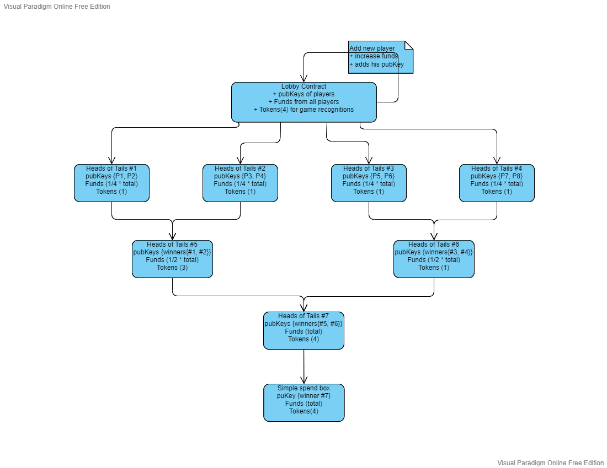
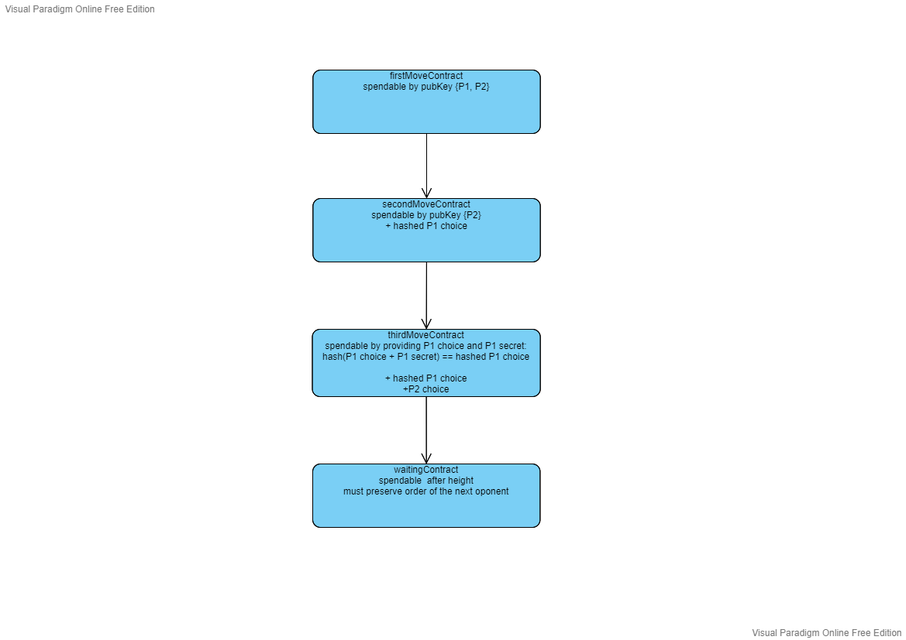

"Heads or Tails game Contract with Parallelization"
=================================

* Author: The-Huginn
* Created: 12/2/2022
* License: CC0
* Difficulty: (Expert)
* Ergo Playground Link: [Heads or Tails Parallel](https://scastie.scala-lang.org/vOsZerQpRdO2y2X0ruKP7w)

Description
----------
This script simulates tournament game of Head or Tails game using parallelization for the games.<br />
Lobby contract collects players and funds. After the contract has enough players, we create a tournament spider in the order of registration of players.<br />
In each round we reduce the total number of players by a factor of 2 until we are left with just a winner.<br />
<br />
One of the players creates the contract, which should hold Tokens for recognizing games later on.<br />
All players should now register. They should write their pubKey, increase the number of players by one and add to the funds and everything else should be preserved.<br />
After the contract contains enough players anybody can sign a transaction to move into the next stage, where we create headsOrTail boxes with pubKeys of players able to play.<br />
One of the two players, who can access the box, inserts his hashed choice into the contract and moves the box into the next state.<br />
The second player, who has not picked yet, can spend this box and add his choice into the new box.<br />
Now any one with a player's one choice and secret can spend this box and get it into a waiting state, where is only the pubKey of the winner.<br />
When all boxes are in a waiting state, we can create new headsOrTails boxes with pubKeys of players still in their respective order. This can be done by anybody.<br />
This is repeated until we have the sole winner of the tournament.<br />
Please note, this script is not safe under certain conditions, such as player 2 can hold the box hostage until the last possible block, then move to thirdMoveContract <br />
and the next block spend this block regardless of the correctness, as the game expires. Also example such as amount of players is not power of 2 will not work. <br />
It is possible to request a recreation of the lobby contract with all it's tokens as is shown in the picture below. <br />
<br />
This example tries to demonstrate some less frequent constructions such as forall() and parallelization of contracts. <br />
It was inspired by the [Heads or Tails game Contract](https://github.com/ergoplatform/ergoscript-by-example/blob/main/headsOrTails.md) 
example and [High Level Design Patterns In Extended UTXO Systems - Parallelized Protocols](https://github.com/Emurgo/Emurgo-Research/blob/master/smart-contracts/High%20Level%20Design%20Patterns%20In%20Extended%20UTXO%20Systems.md#parallelized-protocols)<br />
<br />


<br />



<br />

Code
----------
#### [Click Here To Run The Code Via The Ergo Playground](https://scastie.scala-lang.org/vOsZerQpRdO2y2X0ruKP7w)
```scala
// Head and Tails multistage game
// 0 = Head, 1 = Tails
// We require to get all players into the lobbyBox and after we collect
// all players we can proceed. We Create game boxes, which can be spend in
// parallel and wait until a certain all games are either finished, or someone
// has proceeded them. After the final game we create a simple spend box for the
// winner and we can require to recreate the lobbyBox with all it's tokens
//
// For certain limitations in Playground we are not able to store pubKeys in register,
// which would make it possible to allow more players and higher parallelization. However
// this is possible with the ErgoScript on testnet or mainnet.

// Required import for the Ergo Playground
import org.ergoplatform.compiler.ErgoScalaCompiler._
import org.ergoplatform.playgroundenv.utils.ErgoScriptCompiler
import org.ergoplatform.playground._
// import ErgoBox and hash function
import org.ergoplatform.appkit.{ErgoType, ErgoValue}
import java.util.Base64
import org.ergoplatform.ErgoBox
import scorex.utils.Random
import scorex.crypto.hash.{Blake2b256, Digest32}

// Mockchain
val blockchainSim = newBlockChainSimulationScenario("Heads and Tails multistage example")
// 1 ERG in nanoErgs
val nanoergsInErg = 1000000000L
// Token for recognizing games
val gameToken = blockchainSim.newToken("Game State")

val players = new Array[Party](4)

var i = 0
for (i <- 0 to players.size - 1) {
  players(i) = blockchainSim.newParty("Player number: " + i)
  players(i).generateUnspentBoxes(toSpend = 10 * nanoergsInErg)
}


// txFee holds transaction fee amount
// price how much participant pays for entry
// firstMoveScriptHash hash of the game script
// R4 contains current amount of players
// R5 contains pubKey of first player
// R6 contains pubKey of second player
// R7 contains pubKey of third player
// R8 contains pubKey of fourth player
// For a version without Coll[SigmaProp] we are not able
// efficiently check, whether new player added his pubKey.
// This would have been solved by forall() functions
val lobbyScript = """
  {
    val maxPlayers = 4

    // We are adding new player
    if (OUTPUTS(0).propositionBytes == SELF.propositionBytes)
    {
      val expectNew = OUTPUTS(0).R4[Byte].get <= maxPlayers && OUTPUTS(0).R4[Byte].get == SELF.R4[Byte].get + 1
      val newParticipant = if (!expectNew) false else allOf(Coll(
        OUTPUTS(0).tokens(0)._1 == SELF.tokens(0)._1,
        OUTPUTS(0).tokens(0)._2 == SELF.tokens(0)._2,
        OUTPUTS(0).value == SELF.value + price + (maxPlayers / 2) * txFee,
        OUTPUTS(0).propositionBytes == SELF.propositionBytes,

        // Check for changes in pubKeys of players
        {
          val p1Def = SELF.R5[SigmaProp].isDefined
          if (p1Def) 
            SELF.R5[SigmaProp] == OUTPUTS(0).R5[SigmaProp]
          else
            true
        },
        {
          val p2Def = SELF.R6[SigmaProp].isDefined
          if (p2Def) 
            SELF.R6[SigmaProp] == OUTPUTS(0).R6[SigmaProp]
          else
            true
        },
        {
          val p3Def = SELF.R7[SigmaProp].isDefined
          if (p3Def) 
            SELF.R7[SigmaProp] == OUTPUTS(0).R7[SigmaProp]
          else
            true
        }
      ))
      
      sigmaProp(newParticipant)
    }
    // We are proceeding into games
    else
    {
    val gameStart = allOf(Coll(
      {
        val indices = OUTPUTS.indices
        indices.forall({(i:Int) => (  
            if (i >= maxPlayers / 2) true else
            {
              val correctOrder = if (i == 0)
                                  (OUTPUTS(i).R4[SigmaProp].get == SELF.R5[SigmaProp].get && OUTPUTS(i).R5[SigmaProp].get == SELF.R6[SigmaProp].get)
                                else
                                  (OUTPUTS(i).R4[SigmaProp].get == SELF.R7[SigmaProp].get && OUTPUTS(i).R5[SigmaProp].get == SELF.R8[SigmaProp].get)
              allOf(Coll(
                correctOrder,
                OUTPUTS(i).tokens(0)._1 == SELF.tokens(0)._1,
                OUTPUTS(i).tokens(0)._2 >= 1,                                                       // Each box has at least one Token
                OUTPUTS(i).R6[Coll[Byte]].get(0) == i.toByte,
                OUTPUTS(i).R6[Coll[Byte]].get(1) == SELF.tokens(0)._2.toByte,
                OUTPUTS(i).R7[Coll[Long]].get(0) == HEIGHT + 50,
                OUTPUTS(i).R7[Coll[Long]].get(1) == txFee,
                blake2b256(OUTPUTS(i).propositionBytes) == fromBase64(firstMoveScriptHash)
              ))
              }
        )})
      },
      OUTPUTS(0).tokens(0)._2 == SELF.tokens(0)._2 - (maxPlayers / 2) + 1                                                       // Remaining Tokens are in the first box
      ))
      
      sigmaProp(gameStart)
    }
  }
""".stripMargin

// We allow any of the players to play as the first player but then has to place his pubKey as first
// secondMoveScriptHash expecting hash of the next script in line
// R4 contains pubKey of one player
// R5 contains pubKey of the other player
// R6 contains Collection of index within the game and total number of Tokens - Byte type
// R7 contains Collection the height after which this box can be consumed and txFee constant - Long type
// R8 contains hashed waitingScript
val firstMoveScript = """
  {
    if (blake2b256(OUTPUTS(0).propositionBytes) == fromBase64(secondMoveScriptHash))
    {
      // We check if the order of pubKeys is preserved or not, together with pubKey's spender we decide correct state
      val order = allOf(Coll(
                  OUTPUTS(0).R4[SigmaProp].get == SELF.R4[SigmaProp].get,
                  OUTPUTS(0).R5[SigmaProp].get == SELF.R5[SigmaProp].get
      ))

      val switch = allOf(Coll(
                   OUTPUTS(0).R4[SigmaProp].get == SELF.R5[SigmaProp].get,
                   OUTPUTS(0).R5[SigmaProp].get == SELF.R4[SigmaProp].get
       ))
       
      val pubKeysCorrect = (SELF.R4[SigmaProp].get && order) || (SELF.R5[SigmaProp].get && switch)
    
      val playerPlay = allOf(Coll(
           OUTPUTS(0).value >= SELF.value - SELF.R7[Coll[Long]].get(1),                   // Preserves funds
           OUTPUTS(0).tokens(0)._1 == SELF.tokens(0)._1,                                  // Preserves Tokens
           OUTPUTS(0).tokens(0)._2 == SELF.tokens(0)._2,
           OUTPUTS(0).R6[Coll[Byte]].get == SELF.R6[Coll[Byte]].get,                      // Preserves attributes
           OUTPUTS(0).R7[Coll[Long]].get == SELF.R7[Coll[Long]].get,
           OUTPUTS(0).R8[Coll[Byte]].isDefined                                            // Players choice
      ))
      
      sigmaProp(pubKeysCorrect && playerPlay)
    }
    else
    {
      // If none of the players has played, someone can join the game with their pubKey and proceed the game after certain height
      if ((HEIGHT < SELF.R6[Coll[Long]].get(0)))
        sigmaProp(false)
      else
      sigmaProp(allOf(Coll(
        OUTPUTS(0).value >= SELF.value - SELF.R6[Coll[Long]].get(1),                  // Preserves funds
        OUTPUTS(0).tokens(0)._1 == SELF.tokens(0)._1,                                 // Preserves Tokens
        OUTPUTS(0).tokens(0)._2 == SELF.tokens(0)._2,
        OUTPUTS(0).R4[SigmaProp].isDefined,                                           // anybody can input pubKey to allow the game to proceed
        OUTPUTS(0).R6[Coll[Byte]].get == SELF.R6[Coll[Byte]].get,
        OUTPUTS(0).R7[Coll[Long]].get == SELF.R7[Coll[Long]].get,
        blake2b256(OUTPUTS(0).propositionBytes) == SELF.R8[Coll[Byte]].get
      )))
    }
  }
""".stripMargin

// Second player can now add his choice into the box
// thirdMoveScriptHash expecting hash of the next script in line
// R4 contains pubKey of the first player
// R5 contains pubKey of the second player
// R6 contains Collection of index within the game and total number of Tokens - Byte type
// R7 contains Collection the height after which this box can be consumed and txFee constant - Long type
// R8 contains hashed choice of first player
// R9 contains hashed waitingScript
val secondMoveScript = """
  {
    val player2Play = allOf(Coll(
        OUTPUTS(0).value >= SELF.value - SELF.R7[Coll[Long]].get(1),                // Preserves funds
        OUTPUTS(0).tokens(0)._1 == SELF.tokens(0)._1,                               // Preserves Tokens
        OUTPUTS(0).tokens(0)._2 == SELF.tokens(0)._2,
        OUTPUTS(0).R4[SigmaProp].get == SELF.R4[SigmaProp].get,                     // Preserves pubKeys of players
        OUTPUTS(0).R5[SigmaProp].get == SELF.R5[SigmaProp].get,
        OUTPUTS(0).R6[Coll[Byte]].get(0) == SELF.R6[Coll[Byte]].get(0),             // Preserves attributes
        OUTPUTS(0).R6[Coll[Byte]].get(1) == SELF.R6[Coll[Byte]].get(1),
        OUTPUTS(0).R6[Coll[Byte]].get.size >= 3,                                    // We have p2 Choice
        OUTPUTS(0).R7[Coll[Long]].get == SELF.R7[Coll[Long]].get,
        OUTPUTS(0).R8[Coll[Byte]].get == SELF.R8[Coll[Byte]].get,                   // Preserves player 1 choice
        blake2b256(OUTPUTS(0).propositionBytes) == fromBase64(thirdMoveScriptHash)
      ))
      
    val expired = HEIGHT >= SELF.R7[Coll[Long]].get(0) &&
      allOf(Coll(
        OUTPUTS(0).value == SELF.value - SELF.R7[Coll[Long]].get(1),                  // Preserves funds
        OUTPUTS(0).tokens(0)._1 == SELF.tokens(0)._1,                                 // Preserves Tokens
        OUTPUTS(0).tokens(0)._2 == SELF.tokens(0)._2,
        OUTPUTS(0).R4[SigmaProp].get == SELF.R4[SigmaProp].get,                       // First player proceeds
        OUTPUTS(0).R6[Coll[Byte]].get == SELF.R6[Coll[Byte]].get,
        OUTPUTS(0).R7[Coll[Long]].get == SELF.R7[Coll[Long]].get,
        blake2b256(OUTPUTS(0).propositionBytes) == SELF.R9[Coll[Byte]].get
      ))
  
    sigmaProp((SELF.R5[SigmaProp].get && player2Play) || expired)
  }
""".stripMargin


// waitingScriptHash expecting hash of the next script in line
// R4 contains pubKey of the first player
// R5 contains pubKey of the second player
// R6 contains Collection of index within the game, total number of Tokens and p2Choice - Byte type
// R7 contains Collection the height after which this box can be consumed and txFee constant - Long type
// R8 contains hashed choice of player 1
val thirdMoveScript = """
  {
    val p2Choice = SELF.R6[Coll[Byte]].get(2)
    val p1Choice = OUTPUTS(0).R8[Byte].get
    val p1Secret = OUTPUTS(0).R9[Coll[Byte]].get
    
    if (blake2b256(p1Secret ++ Coll(p1Choice)) == SELF.R8[Coll[Byte]].get)
    {
      val winnerPubKey =  if (p1Choice == p2Choice)
                            SELF.R5[SigmaProp].get          // Player 2 wins
                          else
                            SELF.R4[SigmaProp].get          // Player 1 wins
                            
      val correctOutput = allOf(Coll(
        OUTPUTS(0).value == SELF.value - SELF.R7[Coll[Long]].get(1),                // Preserves funds
        OUTPUTS(0).tokens(0)._1 == SELF.tokens(0)._1,                               // Preserves Tokens
        OUTPUTS(0).tokens(0)._2 == SELF.tokens(0)._2,
        OUTPUTS(0).R4[SigmaProp].get == winnerPubKey,                               // Preserves winner's pubKey
        OUTPUTS(0).R6[Coll[Byte]].get(0) == SELF.R6[Coll[Byte]].get(0),
        OUTPUTS(0).R6[Coll[Byte]].get(1) == SELF.R6[Coll[Byte]].get(1),
        OUTPUTS(0).R7[Coll[Long]].get == SELF.R7[Coll[Long]].get,
        blake2b256(OUTPUTS(0).propositionBytes) == fromBase64(waitingScriptHash)
        ))
        
      sigmaProp (correctOutput)
    }
    else
    {
      val expired = HEIGHT >= SELF.R6[Coll[Long]].get(0) &&
      allOf(Coll(
        OUTPUTS(0).value == SELF.value - SELF.R6[Coll[Long]].get(1),                  // Preserves funds
        OUTPUTS(0).tokens(0)._1 == SELF.tokens(0)._1,                                 // Preserves Tokens
        OUTPUTS(0).tokens(0)._2 == SELF.tokens(0)._2,
        OUTPUTS(0).R4[SigmaProp].get == SELF.R5[SigmaProp].get,                       // Second player proceeds
        OUTPUTS(0).R6[Coll[Byte]].get == SELF.R6[Coll[Byte]].get,
        OUTPUTS(0).R7[Coll[Long]].get == SELF.R7[Coll[Long]].get,
        blake2b256(OUTPUTS(0).propositionBytes) == fromBase64(waitingScriptHash)
      ))
      sigmaProp(expired)
    }
  }
""".stripMargin

// firstMoveScriptHash the same hash as lobbyScript expects
// R4 contains pubKey of the winner
// R5 contains the hash of firstMoveScript
// Please note, firstMoveScript should have a condition to check, whether it's INPUT had correct hash in this register for safety reasons
// Please keep in mind if we process the game to next stage, which is not winner, the txFee is paid by someelse for simplicity reason
// R6 contains Collection of index within the game and total number of Tokens - Byte type
// R7 contains Collection the height after which this box can be consumed and txFee constant - Long type
// R8 contains player's 1 choice
// R9 contains player's 1 secret
val waitingScript = """
  {
    val firstMoveScriptHash = SELF.R5[Coll[Byte]].get
    val txFee = SELF.R7[Coll[Long]].get(1)
    val expectedOutputs = SELF.R6[Coll[Byte]].get(1) - OUTPUTS(0).tokens(0)._2 + 1 // remaining Tokens are in the first box
    val spendable = SELF.R7[Coll[Long]].get(0) <= HEIGHT
    
    val outputsCorrect = allOf(Coll(
      {
        val indices = OUTPUTS.indices
        indices.forall({(i:Int) => (  if (i >= expectedOutputs) true else
                                      OUTPUTS(i).tokens(0)._1 == SELF.tokens(0)._1 &&
                                      OUTPUTS(i).tokens(0)._2 >= 1 &&                                                 // Each box has at least one Token
                                      OUTPUTS(i).value >= 2 * (SELF.value - 2 * txFee) &&                             // After merging 2 boxes we have now double the value
                                      OUTPUTS(i).R4[SigmaProp].get== INPUTS(2 * i).R4[SigmaProp].get &&               // We check for pubKey
                                      INPUTS(2 * i).R6[Coll[Byte]].get(0) == 2 * i &&                                 // We check that the order in spider has not changed
                                      OUTPUTS(i).R5[SigmaProp].get == INPUTS(2 * i + 1).R4[SigmaProp].get &&
                                      INPUTS(2 * i + 1).R6[Coll[Byte]].get(0) == 2 * i + 1 &&
                                      OUTPUTS(i).R6[Coll[Byte]].get(0) == i.toByte &&                                 // We preserve attributes
                                      OUTPUTS(i).R6[Coll[Byte]].get(1) == SELF.R6[Coll[Byte]].get(1) &&
                                      OUTPUTS(i).R7[Coll[Long]].get(0) == HEIGHT + 50  &&
                                      OUTPUTS(i).R7[Coll[Long]].get(1) == SELF.R7[Coll[Long]].get(1) &&
                                      blake2b256(OUTPUTS(i).propositionBytes) == firstMoveScriptHash
                                      )})
      }
    ))
    
    val winner = allOf(Coll(
      OUTPUTS(0).value == SELF.value - SELF.R7[Coll[Long]].get(1),
      OUTPUTS(0).propositionBytes == INPUTS(0).R4[SigmaProp].get.propBytes
    ))
    
    sigmaProp((spendable && outputsCorrect) || winner)
  }
""".stripMargin

// We compile all scripts and link them with each other
val waitingContract = ErgoScriptCompiler.compile(Map(), waitingScript)
val waitingScriptHash = Blake2b256(waitingContract.ergoTree.bytes)

val thirdMoveContract = ErgoScriptCompiler.compile(Map("waitingScriptHash" -> Base64.getEncoder.encodeToString(waitingScriptHash)),
                                                   thirdMoveScript)
val thirdMoveScriptHash = Blake2b256(thirdMoveContract.ergoTree.bytes)

val secondMoveContract = ErgoScriptCompiler.compile(Map("thirdMoveScriptHash" -> Base64.getEncoder.encodeToString(thirdMoveScriptHash)),
                                                   secondMoveScript)
val secondMoveScriptHash = Blake2b256(secondMoveContract.ergoTree.bytes)

val firstMoveContract = ErgoScriptCompiler.compile(Map("secondMoveScriptHash"  -> Base64.getEncoder.encodeToString(secondMoveScriptHash)),
                                                  firstMoveScript)
val firstMoveScriptHash = Blake2b256(firstMoveContract.ergoTree.bytes)

val lobbyContract = ErgoScriptCompiler.compile(Map( "txFee"           -> MinTxFee,
                                                    "price"           -> nanoergsInErg,
                                                    "firstMoveScriptHash"  -> Base64.getEncoder.encodeToString(firstMoveScriptHash)),
                                              lobbyScript)

///////////////////////
// The start of demo //
///////////////////////

val totalTokens = players.size
// We create the lobby Box
var lobbySigned = createLobby(totalTokens)


println("--------------------")
println("| Waiting for lobby|")
println("--------------------")

// We add 4 players to the game, into the lobbyBox
lobbySigned = addPlayer(lobbySigned, players, nanoergsInErg, 0)
lobbySigned = addPlayer(lobbySigned, players, nanoergsInErg, 1)
lobbySigned = addPlayer(lobbySigned, players, nanoergsInErg, 2)
lobbySigned = addPlayer(lobbySigned, players, nanoergsInErg, 3)

println("--------------------")
println("|  Lobby is full   |")
println("| Creating 2 games |")
println("--------------------")

var height = blockchainSim.getHeight + 50
val firstRoundSigned = createFirstRound(
  lobbySigned,
  totalTokens,
  height)

// Now we simulate playing the game
// We receive boxes waiting for another progress
val (firstGame, winner1) = playGame(firstRoundSigned,
         0, // player 0
         1, // player 1
         0, // gameIndex
         totalTokens.toByte,
         totalTokens - 1, // amount of tokens
         height)
val (secondGame, winner2) = playGame(firstRoundSigned,
         2, // player 0
         3, // player 1
         1, // gameIndex
         totalTokens.toByte,
         1, // amount of tokens
         height)

height = blockchainSim.getHeight + 50
blockchainSim.setHeight(height)
height += 50

val finalRoundSigned = createSecondRound(
  winner1,
  winner2,
  firstGame,
  secondGame,
  totalTokens,
  height)

// Again we simulate running the game
val (gameResult, finalWinner) = playGame(finalRoundSigned,
         winner1, // player 0
         winner2, // player 1
         0, // gameIndex
         totalTokens.toByte,
         totalTokens, // amount of tokens
         height)

// We create a box for the final player a simple spend box
val playerWithdrawBox = Box(
                          value  = gameResult.outputs(0).value - MinTxFee,
                          script = contract(players(finalWinner).wallet.getAddress.pubKey))
val withdrawTransaction = Transaction(
                          inputs = List(gameResult.outputs(0)),
                          outputs = List(playerWithdrawBox),
                          fee = MinTxFee,
                          sendChangeTo = players(finalWinner).wallet.getAddress)
val withdrawSigned = players(finalWinner).wallet.sign(withdrawTransaction)
blockchainSim.send(withdrawSigned)

println("---------------------------------------------")
println("Successful finish, total winner is Player : " + finalWinner)
println("---------------------------------------------")

/////////////////////
// The end of demo //
/////////////////////


///////////////////// FUNCTIONS /////////////////////
// This function simulates playing of the game
def playGame(previousTransaction: org.ergoplatform.ErgoLikeTransaction,
            playerOne: Byte,
            playerTwo: Byte,
            gameIndex: Byte,
            totalTokens: Byte,
            tokenAmount: Long,
            expiration: Long) : (org.ergoplatform.ErgoLikeTransaction, Byte) = {
  
  println("--------------------")
  println("|  Playing game " + gameIndex +"  |")
  println("--------------------")
  
  // Randomly choose player
  val playingPlayer = if (scala.util.Random.nextBoolean) playerOne else playerTwo
  val secondPlayer = if (playingPlayer == playerOne) playerTwo else playerOne
  // Randomly generate choices
  val p1Choice:Byte = if (scala.util.Random.nextBoolean) 0x01 else 0x00
  val p1Secret:Array[Byte] = Random.randomBytes(31)
  val p2Choice:Byte = if (scala.util.Random.nextBoolean) 0x01 else 0x00
  
  println("--------------------")
  println("Player " + playingPlayer + " is playing game number: " + gameIndex + ", his choice is: " + p1Choice + ". Waiting for player " + secondPlayer + " to play next...")
  println("Player " + secondPlayer + " is playing game number: " + gameIndex + ", his choice is: " + p2Choice + ".")
  println("--------------------")
  
  val p1ChoiceHash: Digest32 = Blake2b256(p1Secret :+ p1Choice)
  val initialByteColl: Array[Byte] = Array(gameIndex, totalTokens)
  val initialLongColl: Array[Long] = Array(expiration, MinTxFee)
  
  // playing Player plays
  val firstMoveBox = Box(
                      value = previousTransaction.outputs(0).value - MinTxFee,
                      registers = Map(
                                    R4 -> players(playingPlayer).wallet.getAddress.pubKey,
                                    R5 -> players(secondPlayer).wallet.getAddress.pubKey,
                                    R6 -> initialByteColl,
                                    R7 -> initialLongColl,
                                    R8 -> p1ChoiceHash,
                                    R9 -> waitingScriptHash),
                      token = (gameToken -> tokenAmount),
                      script = secondMoveContract
                      )
  
  val firstMoveTx = Transaction(
                inputs = List(previousTransaction.outputs(gameIndex)),
                outputs = List(firstMoveBox),
                fee = MinTxFee,
                sendChangeTo = players(playingPlayer).wallet.getAddress
              )

  val firstMoveSigned = players(playingPlayer).wallet.sign(firstMoveTx)
  blockchainSim.send(firstMoveSigned)
  
  // Player 2 plays, adds his choice to the register
  val p2ChoiceByteColl = initialByteColl :+ p2Choice
  val secondMoveBox = Box(
                      value = firstMoveSigned.outputs(0).value - MinTxFee,
                      registers = Map(
                                    R4 -> players(playingPlayer).wallet.getAddress.pubKey,
                                    R5 -> players(secondPlayer).wallet.getAddress.pubKey,
                                    R6 -> p2ChoiceByteColl,
                                    R7 -> initialLongColl,
                                    R8 -> p1ChoiceHash,
                                    R9 -> waitingScriptHash),
                      token = (gameToken -> tokenAmount),
                      script = thirdMoveContract
                      )
  
  val secondMoveTx = Transaction(
                inputs = List(firstMoveSigned.outputs(0)),
                outputs = List(secondMoveBox),
                fee = MinTxFee,
                sendChangeTo = players(secondPlayer).wallet.getAddress
              )

  val secondMoveSigned = players(secondPlayer).wallet.sign(secondMoveTx)
  blockchainSim.send(secondMoveSigned)
  
  
  // We now expose player's one choice and secret and let the game continue
  val winner = if (p1Choice == p2Choice) secondPlayer else playingPlayer
  println("Winner is: " + winner)
  val resultGameBox = Box(
                      value = secondMoveSigned.outputs(0).value - MinTxFee,
                      registers = Map(
                                    R4 -> players(winner).wallet.getAddress.pubKey,
                                    R5 -> firstMoveScriptHash,
                                    R6 -> initialByteColl,
                                    R7 -> initialLongColl,
                                    R8 -> p1Choice,
                                    R9 -> p1Secret),
                      token = (gameToken -> tokenAmount),
                      script = waitingContract
                      )
  
  val resultTx = Transaction(
                inputs = List(secondMoveSigned.outputs(0)),
                outputs = List(resultGameBox),
                fee = MinTxFee,
                sendChangeTo = players(0).wallet.getAddress
              )

  // Anybody can sign this box
  val resultSigned = players(0).wallet.sign(resultTx)
  blockchainSim.send(resultSigned)
  
  return (resultSigned, winner)
}

def createSecondRound(winner1: Byte,
                      winner2: Byte,
                      firstGame: org.ergoplatform.ErgoLikeTransaction,
                      secondGame: org.ergoplatform.ErgoLikeTransaction,
                      totalTokens: Long,
                      height: Long) : org.ergoplatform.ErgoLikeTransaction = {
  val finalGameBox = createGameBox(firstGame.outputs(0).value * 2,
                                winner1,
                                winner2,
                                0,      // gameIndex
                                totalTokens.toByte, // All tokens should be in this box
                                height,
                                totalTokens)
  val finalGameTx = Transaction(
                  inputs = List(firstGame.outputs(0), secondGame.outputs(0)) ++ players(0).selectUnspentBoxes(toSpend = MinTxFee),
                  outputs = List(finalGameBox),
                  fee = MinTxFee,
                  sendChangeTo = players(0).wallet.getAddress
                )
  // We deploy our final game Box to the mockchain
  val finalRoundSigned = players(0).wallet.sign(finalGameTx)
  blockchainSim.send(finalRoundSigned)
  
  return finalRoundSigned
}

def createFirstRound(lobbySigned: org.ergoplatform.ErgoLikeTransaction,
                     totalTokens: Long,
                     height: Long) : org.ergoplatform.ErgoLikeTransaction = {
  val firstGameBox = createGameBox(lobbySigned.outputs(0).value / 2,
                                   0, // player 0
                                   1, // player 1
                                   0, // gameIndex
                                   totalTokens.toByte,
                                   height,
                                   totalTokens - 1) // outputs(0) has remaining tokens
  val secondGameBox = createGameBox(lobbySigned.outputs(0).value / 2,
                                    2,  // player 2
                                    3,  // player 3
                                    1,  // gameIndex
                                    totalTokens.toByte,
                                    height,
                                    1)    // default to have 1 token
  val firstRoundTx = Transaction(
                  inputs = players(0).selectUnspentBoxes(toSpend = MinTxFee) :+ lobbySigned.outputs(0),
                  outputs = List(firstGameBox, secondGameBox),
                  fee = MinTxFee,
                  sendChangeTo = players(0).wallet.getAddress
                )
  // We deploy our game Boxes to the mockchain, they can be spend separately
  val firstRoundSigned = players(0).wallet.sign(firstRoundTx)
  blockchainSim.send(firstRoundSigned)
  
  return firstRoundSigned
}

// @brief This function creates box, which can be played by one of the players
def createGameBox(value: Long,
                  playerOne: Byte,
                  playerTwo: Byte,
                  gameIndex: Byte,
                  totalTokens: Byte,
                  expiration: Long,
                  tokenAmount: Long) : org.ergoplatform.ErgoBoxCandidate = {
  
  val register6Coll: Array[Byte] = Array(gameIndex, totalTokens)
  val register7Coll: Array[Long] = Array(expiration, MinTxFee)
  
  return Box(
                value = value,
                registers = Map(
                              R4 -> players(playerOne).wallet.getAddress.pubKey,
                              R5 -> players(playerTwo).wallet.getAddress.pubKey,
                              R6 -> register6Coll,
                              R7 -> register7Coll,
                              R8 -> waitingScriptHash),
                token = (gameToken  ->  tokenAmount),
                script = firstMoveContract
                )
}

// @brief This function adds new player to the lobby
def addPlayer (previousTransaction: org.ergoplatform.ErgoLikeTransaction,
              players: Array[Party],
              price: Long,
              playerNumber: Byte) : org.ergoplatform.ErgoLikeTransaction = {
  
    val totalPlayers:Byte = (playerNumber + 1).toByte
    // We automatically update all registers for simplicity
    val lobbyBox = Box(
              value = previousTransaction.outputs(0).value + nanoergsInErg + (players.size / 2) * MinTxFee,
              registers = Map(
                          R4 -> totalPlayers,
                          R5 -> players(0).wallet.getAddress.pubKey,
                          R6 -> players(1).wallet.getAddress.pubKey,
                          R7 -> players(2).wallet.getAddress.pubKey,
                          R8 -> players(3).wallet.getAddress.pubKey),
              token = (gameToken -> players.size.toLong),
              script = lobbyContract
              )
  
    val lobbyTx = Transaction(
              inputs = players(playerNumber).selectUnspentBoxes(toSpend = (nanoergsInErg + (players.size / 2) * MinTxFee)) :+ previousTransaction.outputs(0),
              outputs = List(lobbyBox),
              fee = MinTxFee,
              sendChangeTo = players(playerNumber).wallet.getAddress
              )
  
    var lobbySigned = players(playerNumber).wallet.sign(lobbyTx)
    blockchainSim.send(lobbySigned)
  
    return lobbySigned
}

def createLobby(totalTokens: Long) : org.ergoplatform.ErgoLikeTransaction = {
  var lobbyBox = Box(
                  value = MinTxFee,
                  registers = Map(R4 -> 0.toByte),
                  token = (gameToken  ->  totalTokens),
                  script = lobbyContract
                  )

  val lobbyTx = Transaction(
                  inputs = players(0).selectUnspentBoxes(toSpend = MinTxFee),
                  outputs = List(lobbyBox),
                  fee = MinTxFee,
                  sendChangeTo = players(0).wallet.getAddress
                )

  // We deploy our lobby Box to the mockchain
  var lobbySigned = players(0).wallet.sign(lobbyTx)
  blockchainSim.send(lobbySigned)
  return lobbySigned
}


```
