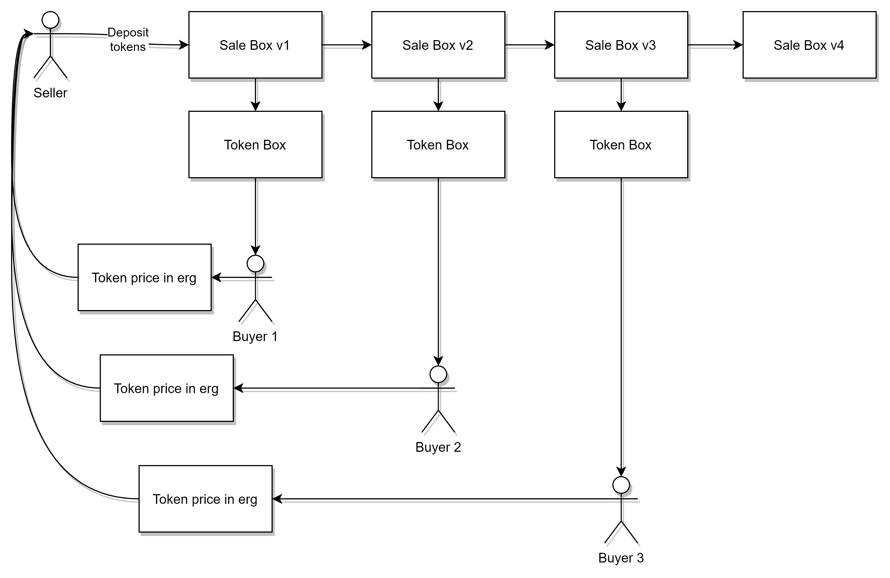

"Self-Replicating Token Sale Contract"
=================================

* Author: Luivatra
* Created: 2021-10-05
* License: CC0
* Difficulty: Beginner
* Ergo Playground Link: [Self-Replicating Token Sale Contract](https://scastie.scala-lang.org/Tgp6KdnDRoaiiGJkNYvb9g)

Description
----------
Imagine having a bunch of tokens you would like to sell, but you don't really want to deal with sending them to individual wallets and you want to be sure you get the correct amount of erg for each token.
Thanks to this great feature of ErgoScript you can create a self-replicating box that does just that!
A self-replicating box can only be spent if the output contains a box protected by the same contract as the original box. This helps the seller build a contract that facilitates the sale of one token while ensuring the rest of his tokens are put up for sale again afterwards, so anyone can buy a token as long as the supply lasts. 



Code
----------
#### [Click Here To Run The Code Via The Ergo Playground](https://scastie.scala-lang.org/Tgp6KdnDRoaiiGJkNYvb9g)
```scala

import org.ergoplatform.compiler.ErgoScalaCompiler._
import org.ergoplatform.playgroundenv.utils.ErgoScriptCompiler
import org.ergoplatform.playground._
import org.ergoplatform.ErgoBox
import org.ergoplatform.settings.ErgoAlgos

///////////////////////////////////////////////////////////////////////////////////
// Prepare A Test Scenario //
///////////////////////////////////////////////////////////////////////////////////
// Create a simulated blockchain (aka "Mockchain")
val blockchainSim = newBlockChainSimulationScenario("Erdoge dispenser Scenario")
// Defining the amount of nanoergs in an erg, making working with amounts easier
val nanoergsInErg = 1000000000L
// Create a new token called ERDoge
val erdoge = blockchainSim.newToken("ERDoge")

// We keep track of the remaining amount of erdoge
val erdogeTotal = 100L
// Define the erdoge seller 
val seller = blockchainSim.newParty("Erdoge rug puller")

// Define the erdoge buyers
val buyerA = blockchainSim.newParty("Alice")
val buyerB = blockchainSim.newParty("Bob")
val buyerC = blockchainSim.newParty("Charlie")

///////////////////////////////////////////////////////////////////////////////////
// Sale Contract                                                                //
///////////////////////////////////////////////////////////////////////////////////

// This script ensures that the seller is paid 4 erg for each erdoge and that only 
// 1 erdoge is sold in each transaction.
// Selleroutput:  Ensures the first output box is send to the seller & the value is at least minPrice
// tokenOutput:   Ensures the second output contains 1 erdoge
// selfOutput:    Ensures that the third output is protected by the same script and contains 1 erdoge less 
//                than the current box. If we have run out of tokens this does not matter

val saleScript = s"""
  {
    val defined = OUTPUTS.size >= 3
    sigmaProp (if (defined) {
      val sellerOutput = OUTPUTS(0).propositionBytes == seller.propBytes && OUTPUTS(0).value >= minPrice
      val tokenOutput = OUTPUTS(1).tokens(0)._1 == erdoge && OUTPUTS(1).tokens(0)._2 == 1L
      val selfOutput = (OUTPUTS(2).propositionBytes == SELF.propositionBytes && OUTPUTS(2).tokens(0)._2 == (SELF.tokens(0)._2 - 1)) || SELF.tokens(0)._2 <= 1
      sellerOutput && tokenOutput && selfOutput
    } else { false } )
  }
""".stripMargin

// Compile the contract with an included `Map` which specifies what the values of given parameters are going to be hard-coded into the contract
val saleContract = ErgoScriptCompiler.compile(Map("seller" -> seller.wallet.getAddress.pubKey, 
                                                  "erdoge" -> erdoge.tokenId,
                                                  "minPrice" -> 4*nanoergsInErg
                                                  ), saleScript)

///////////////////////////////////////////////////////////////////////////////////
// Wallet initializations                                                        //
///////////////////////////////////////////////////////////////////////////////////
val startingFunds = 200 * nanoergsInErg

seller.generateUnspentBoxes(toSpend = startingFunds, tokensToSpend = List(erdoge -> erdogeTotal))
seller.printUnspentAssets()
println("-----------")
// Generate initial userFunds in the user's wallet
buyerA.generateUnspentBoxes(toSpend = startingFunds)
buyerA.printUnspentAssets()
println("-----------")

buyerB.generateUnspentBoxes(toSpend = startingFunds)
buyerB.printUnspentAssets()
println("-----------")

buyerC.generateUnspentBoxes(toSpend = startingFunds)
buyerC.printUnspentAssets()
println("-----------")


// The initial box for the deposit of erdoge by the seller
val initialBox      = Box(value = MinTxFee,
                          token = (erdoge -> 100L),
                          script = saleContract) 

// Create the transaction which deposits the erdoge protected by the sale contract
val initialTransaction = Transaction(
      inputs       = seller.selectUnspentBoxes(toSpend = startingFunds),
      outputs      = List(initialBox),
      fee          = MinTxFee,
      sendChangeTo = seller.wallet.getAddress
    )

// Sign the initialTransaction
var initialTransactionSigned = seller.wallet.sign(initialTransaction)

// Submit the tx to the simulated blockchain
blockchainSim.send(initialTransactionSigned)
seller.printUnspentAssets()
println("-----------")

// We make a list of the buyers so they can be selected randomly, who will be lucky enough to buy the most erdoge?
val buyers = List(buyerA,buyerB,buyerC)

// The Ergo Playground does not handle tokens correctly yet, so to make sure noone gets cheated we keep track of it here
// obviously this is not needed on the real blockchain
var erdogeAmounts = scala.collection.mutable.Map(buyerA -> 0L, buyerB -> 0L, buyerC -> 0L)

// A reference to the box containing the erdoge
var saleBox = initialTransactionSigned.outputs(0)

// While there is erdoge remaining we pick a lucky buyer who gets to buy 1 erdoge for 4 erg
// Every transaction results in a new box containing the remaining erdoge, protected by the sale contract
for(erdogeCounter <- erdogeTotal to 1L by -1)
{
  saleBox = buyErdoge(buyers(scala.util.Random.nextInt(3)),saleBox)
}

// Making sure the ergo playground has not cheated anyone out of erdoge, not needed on real blockchain
buyerA.generateUnspentBoxes(toSpend=0, tokensToSpend = List(erdoge -> erdogeAmounts(buyerA)))
buyerB.generateUnspentBoxes(toSpend=0, tokensToSpend = List(erdoge -> erdogeAmounts(buyerB)))
buyerC.generateUnspentBoxes(toSpend=0, tokensToSpend = List(erdoge -> erdogeAmounts(buyerC)))

seller.printUnspentAssets()
buyerA.printUnspentAssets()
buyerB.printUnspentAssets()
buyerC.printUnspentAssets()


// Function that buys erdoge for a given buyer from a sales box 
def buyErdoge(buyer: Party, saleBox: ErgoBox) : ErgoBox = {
  // Find the remaining amount of erdoge in the saleBox
  val erdogeRemaining = saleBox.additionalTokens.find(t => ErgoAlgos.encode(t._1)==ErgoAlgos.encode(erdoge.tokenId)).get._2
  
  // This will be the new sale box, also protected by the sale contract
  val newSaleBox    = Box(value = MinTxFee,
                         token = (erdoge -> (erdogeRemaining-1)),
                         script = saleContract)
  
  // This is the box that will make sure the seller gets 4 erg
  val sellerBox     = Box(value = 4 * nanoergsInErg,
                         script = contract(seller.wallet.getAddress.pubKey))
  
  // The buyer gets 1 erdoge token out of this transaction
  val erdogeBox     = Box(value = MinTxFee,
                         token = (erdoge -> 1L),
                         script = contract(buyer.wallet.getAddress.pubKey))
  
  // Token administration, only needed in the playground
  erdogeAmounts(buyer) = erdogeAmounts(buyer)+1L
  
  // The erdoge buy transaction, remember the output boxes need to be in the right order
  val buyerTransaction = Transaction(
        inputs       = buyer.selectUnspentBoxes(toSpend = (4 * nanoergsInErg + 2 * MinTxFee)) ++ List(saleBox),
        outputs      = List(sellerBox,erdogeBox,newSaleBox),
        fee          = MinTxFee,
        sendChangeTo = buyer.wallet.getAddress
      )
  
  val signedTransaction = buyer.wallet.sign(buyerTransaction)
  blockchainSim.send(signedTransaction)
  
  // Return the new sale box so it can be used again for buying more erdoge!
  signedTransaction.outputs(2)
}
