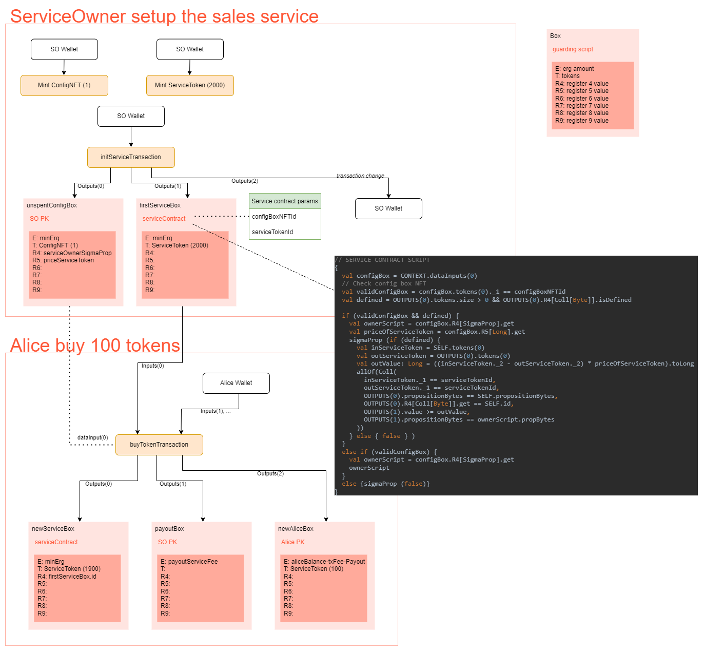

Token Sales Service
=================================

* Author: code-for-uss
* Created: October 08 2021
* License: CC0
* Difficulty: Expert
* Ergo Playground Link: [Token Sales Service](https://scastie.scala-lang.org/w2XmzPXeR5K4lyt4PCUcJw)

Description
----------
In this example, we will learn how to use dataInputs in our contacts. DataInputs are unspent boxes that won't be spent when using this box as data input of a transaction, and only the context inside it will be used. Thus, it doesn't need to sign the box in order to use it as datainput.

In this scenario, we have a configBox as dataInput of our service, which contains the owner's address of the service (to pay purchased tokens' value) and the price of each ServiceToken.

Our service sells ServiceTokens according to the price defined in the configBox, which can be protected under any script. Suppose the owner of ConfigNFT decides to change the price of the tokens or the deposit address. In that case, the values can be changed in the registers (R4 as ownerScript and R5 as priceOfServiceToken) of the mentioned box. Thus, no change is required in the serviceContract.

Diagram
----------


Code
----------
#### [Click Here To Run The Code Via The Ergo Playground](https://scastie.scala-lang.org/w2XmzPXeR5K4lyt4PCUcJw)
```scala
import org.ergoplatform.compiler.ErgoScalaCompiler._
import org.ergoplatform.playgroundenv.utils.ErgoScriptCompiler
import org.ergoplatform.playground._
import org.ergoplatform.playgroundenv.models.TokenAmount
import org.ergoplatform.DataInput


///////////////////////////////////////////////////////////////////////////////////
// Token sales service                                                           //
///////////////////////////////////////////////////////////////////////////////////
///////////////////////////////////////////////////////////////////////////////////
// Prepare a test scenario in order to use dataInputs                                  //
///////////////////////////////////////////////////////////////////////////////////
// Create a simulated blockchain (aka "Mockchain")
val blockchainSim = newBlockChainSimulationScenario("Token sales service")

// Create a new token called "ConfigNFT"
val configNFT = blockchainSim.newToken("ConfigNFT")
val configNFTAmount = 1L

// Create a new token called "ServiceToken"
val serviceToken = blockchainSim.newToken("ServiceToken")
val serviceTokenAmount = 2000L

// Define a wallet for the owner of the service
val serviceOwner = blockchainSim.newParty("owner")

// Define wallet for Alice as a buyer in this scenario
val alice = blockchainSim.newParty("Alice")

///////////////////////////////////////////////////////////////////////////////////
// Create the required initial boxes //
///////////////////////////////////////////////////////////////////////////////////

// Define required values
val minErg = 100000L
val nanoergsInErg = 1000000000L

// Generate the initial balance in the owner's wallet
val serviceOwnerFunds = 2 * nanoergsInErg
serviceOwner.generateUnspentBoxes(
      toSpend       = serviceOwnerFunds,
      tokensToSpend = List(serviceToken -> serviceTokenAmount, configNFT -> configNFTAmount)
)
serviceOwner.printUnspentAssets()
println("-----------")

// Generate the initial balance in Alice's wallet (as a buyer of the ServiceToken from the service)
var aliceBalance = 500 * nanoergsInErg
alice.generateUnspentBoxes(
      toSpend       = aliceBalance
)
alice.printUnspentAssets()
println("-----------")

///////////////////////////////////////////////////////////////////////////////////
// Token sales service contract                                                  //
///////////////////////////////////////////////////////////////////////////////////

// We have a configBox as dataInputs of buyTokenTransaction, which contains two registers (R4 as ownerScript and R5 as priceOfServiceToken) and a NFT token (ConfigNFT).
// The main spending path ensures that the box can be spent in a transaction producing at least three boxes:
// newServiceBox output with tokens of type ServiceToken (numberOfServiceTokenInServiceBox - numberOfSoldTokens) and is given to serviceContract
// payoutBox output with the purchased value of the ServiceToken (numberOfSoldTokens * priceServiceToken) and  is given to the owner of the service (data used in this box exist in ConfigBox)
// newAliceBox output with tokens of type ServiceToken (by the value of numberOfSoldTokens) is given to Alice as a buyer.
// The condition (OUTPUTS(0).R4[Col[Byte]].get == SELF.id) ensures that if Token sales service has multiple of such boxes outstanding at that moment, each of them will produce a separate output that identifies the corresponding input.

val serviceScript = s"""
  {
    val configBox = CONTEXT.dataInputs(0)
    // Check config box NFT
    val validConfigBox = configBox.tokens(0)._1 == configBoxNFTId
    val defined = OUTPUTS(0).tokens.size > 0 && OUTPUTS(0).R4[Coll[Byte]].isDefined

    if (validConfigBox && defined) {
      val ownerScript = configBox.R4[SigmaProp].get
      val priceOfServiceToken = configBox.R5[Long].get
      sigmaProp (if (defined) {
        val inServiceToken = SELF.tokens(0)
        val outServiceToken = OUTPUTS(0).tokens(0)
        val outValue: Long = ((inServiceToken._2 - outServiceToken._2) * priceOfServiceToken).toLong
        allOf(Coll(
            inServiceToken._1 == serviceTokenId,
            outServiceToken._1 == serviceTokenId,
            OUTPUTS(0).propositionBytes == SELF.propositionBytes,
            OUTPUTS(0).R4[Coll[Byte]].get == SELF.id,
            OUTPUTS(1).value >= outValue,
            OUTPUTS(1).propositionBytes == ownerScript.propBytes
            ))
      } else { false } )
    }
    else if (validConfigBox) {
      val ownerScript = configBox.R4[SigmaProp].get
      ownerScript
    }
    else {sigmaProp (false)}
  }
""".stripMargin

// Compile the contract with an included `Map` which specifies what the values of the given parameters are going to be hard-coded into the contract
val serviceContract = ErgoScriptCompiler.compile(Map("configBoxNFTId" -> configNFT.tokenId,
                                                     "serviceTokenId" -> serviceToken.tokenId), serviceScript)

val serviceOwnerSigmaProp = serviceOwner.wallet.getAddress.pubKey
val priceServiceToken = 2 * nanoergsInErg

// Create configBox contains registers R4(service owner publicKey), R5(price each service token) and one token (ConfigNFT)
val configBox = Box(value = minErg,
                    token  = configNFT -> configNFTAmount,
                    registers = Map(
                      R4 -> serviceOwnerSigmaProp,
                      R5 -> priceServiceToken
                    ),
                    script = contract(serviceOwner.wallet.getAddress.pubKey))

// create serviceBox contains one token (ServiceToken)
val firstServiceBox = Box(value = minErg,
                          token  = serviceToken -> serviceTokenAmount,
                          script = serviceContract)

// Create the  serviceTransaction which locks the serviceToken under the serviceContract
// also locks the ConfigNFT under the serviceOwner wallet
val initServiceTransaction = Transaction(
      inputs       = serviceOwner.selectUnspentBoxes(toSpend = serviceOwnerFunds, tokensToSpend = List(serviceToken -> serviceTokenAmount, configNFT -> configNFTAmount)),
      outputs      = List(configBox, firstServiceBox),
      fee          = MinTxFee,
      sendChangeTo = serviceOwner.wallet.getAddress
    )

// Print initServiceTransaction
println("initServiceTransaction is:", initServiceTransaction)

// Sign the Transaction
val initServiceTransactionSigned = serviceOwner.wallet.sign(initServiceTransaction)

// Submit the tx to the simulated blockchain
blockchainSim.send(initServiceTransactionSigned)
serviceOwner.printUnspentAssets()
println("-----------")

println("===== Start buying tokens from the service =====")

// Select last unspentConfigBox from serviceOwner wallet, this box can be protected under any publicKey, we do not need to sign the box to use as dataInput
val unSpentConfigBox = serviceOwner.selectUnspentBoxes(toSpend = minErg, tokensToSpend = List(TokenAmount(configNFT, configNFTAmount))).head

val serviceBox = initServiceTransactionSigned.outputs(1)

val amountOfNeededToken = 100L
// The amount required to pay by alice is equal to amount of required tokens * the price of each serviceToken
val payoutServiceFee = amountOfNeededToken * priceServiceToken

// Create new service box
// token = serviceToken with new amount of serviceToken
// register = R4 -> id of previous unspent service box
val newServiceBox = Box(value = minErg,
                        token  = (serviceToken -> (serviceTokenAmount - amountOfNeededToken)),
                        register = (R4 -> serviceBox.id),
                        script = serviceContract)

// Create payout box under pubKey serviceOwnerSigmaProp
// value = amount of required tokens * the price of each serviceToken
val payoutBox = Box(value = payoutServiceFee,
                    script = contract(serviceOwnerSigmaProp))

// Create AliceBox with purchased serviceTokens
// token = serviceToken with amount of tokens required
val newAliceBox = Box(value = (aliceBalance - payoutServiceFee - MinTxFee),
                      token  = (serviceToken -> (amountOfNeededToken)),
                      script = contract(alice.wallet.getAddress.pubKey))

// Create the transaction which locks the buyer funds under the serviceOwnerSigmaProp and locks purchased tokens under Alice's pubKey.
// Note: This transaction can have a change box that belongs to Alice.
val buyTokenTransaction = Transaction(
      inputs       = List(serviceBox) ++ alice.selectUnspentBoxes(toSpend = aliceBalance),
      outputs      = List(newServiceBox, payoutBox, newAliceBox),
      fee          = MinTxFee,
      dataInputs   = List(DataInput(unSpentConfigBox.id)),
      sendChangeTo = alice.wallet.getAddress
    )

// Print buyTokenTransaction
println("buyTokenTransaction is:", buyTokenTransaction)

// Sign the buyOrderTransaction
val buyTokenTransactionSigned = alice.wallet.sign(buyTokenTransaction)

// Submit the tx to the simulated blockchain
blockchainSim.send(buyTokenTransactionSigned)
println("ConfigBox: ", serviceOwner.selectUnspentBoxes(toSpend = minErg, tokensToSpend = List(TokenAmount(configNFT, configNFTAmount))).head)
println("New Service Box: ", buyTokenTransaction.outputs(0))
println("Payout Box: ", buyTokenTransaction.outputs(1))
println("Purchased tokens Box: ", buyTokenTransaction.outputs(2))
serviceOwner.printUnspentAssets()
alice.printUnspentAssets()
println("-----------")

```
